# Templanza

Trabajo final de la materia de Desarrollo Web. Tienda online de hierbas para té, con un foro comunitario de **blends** (combinaciones de hierbas armadas y compartidas por los usuarios).

## Descripción del proyecto

Templanza combina dos cosas en una sola app:

- **Tienda**: catálogo de plantas (hierbas individuales) que se compran directamente, con carrito, orden con precio congelado y pago con Mercado Pago (QR/redirect según el dispositivo).
- **Foro de blends**: cualquier usuario registrado puede armar un *blend* (receta con varias plantas y sus proporciones) y publicarlo. Pasa por moderación de un Admin/Operador antes de ser visible, y admite comentarios y "me gusta". Aparte existen los **blends recomendados**: recetas oficiales curadas por Templanza, que se publican directo sin pasar por moderación.

### Stack técnico

- .NET 9, ASP.NET Core MVC
- Entity Framework Core (Code First) con migraciones, SQL Server (LocalDB en desarrollo)
- ASP.NET Core Identity (registro, login, recuperación de contraseña, roles, perfil)
- Envío real de emails (confirmación de cuenta y recuperación de contraseña) vía Gmail SMTP con MailKit
- Bootstrap 5 + DataTables + SweetAlert2
- Reporte de ventas resuelto con un stored procedure

### Modelo de dominio

`Categoria`, `Planta`, `Efecto` (N:N vía `PlantaEfecto` con intensidad), `Blend`, `BlendPlanta` (N:N con cantidad/unidad), `Comentario`, `BlendLike`, `Orden`/`ItemOrden` (con precio congelado al momento de compra), `CorreoEnviado` (log de emails), además de `ApplicationUser` (extiende Identity con Nombre e ImagenUrl).

### Roles

- **Administrador** / **Operador**: acceso al backoffice (`/Admin`), gestionan el catálogo, moderan el foro, ven órdenes y el reporte de ventas.
- **Cliente**: rol asignado automáticamente al registrarse. Compra en la tienda y participa del foro.

## Instalación y ejecución

### Requisitos

- [.NET 9 SDK](https://dotnet.microsoft.com/download)
- SQL Server LocalDB (viene con Visual Studio) o una instancia de SQL Server accesible
- Una cuenta de Gmail con una [contraseña de aplicación](https://myaccount.google.com/apppasswords) si querés que los emails de confirmación/recuperación se envíen de verdad (opcional para levantar el proyecto)

### Pasos

1. Cloná el repositorio y abrí la carpeta `Templanza` (donde está el `.csproj`):

   ```bash
   git clone https://github.com/pedrohriestra/Templanza.git
   cd Templanza/Templanza
   ```

2. Configurá la cadena de conexión en `appsettings.json` si no usás LocalDB con el nombre por default (ya viene lista para LocalDB, no hace falta tocar nada en la mayoría de los casos).

3. (Opcional) Configurá el envío de emails con `dotnet user-secrets` — si no lo hacés, el registro/login van a funcionar igual, pero no va a llegar ningún email real:

   ```bash
   dotnet user-secrets set "Smtp:Usuario" "tu-email@gmail.com"
   dotnet user-secrets set "Smtp:Password" "tu-contraseña-de-aplicacion-de-16-caracteres"
   ```

4. Aplicá las migraciones (crea la base de datos con el esquema y los datos iniciales):

   ```bash
   dotnet ef database update
   ```

5. Corré la aplicación:

   ```bash
   dotnet run
   ```

6. Abrí `https://localhost:{puerto}` (el puerto que indique la consola). Al arrancar por primera vez, la app crea sola los roles (Administrador, Operador, Cliente) y un usuario administrador:

   ```
   Email: admin@templanza.com
   Contraseña: Admin123!
   ```

### Pago con Mercado Pago

El link de cobro se configura en `appsettings.json` → `MercadoPago:PaymentLink`. Al confirmar una compra, la orden queda en estado *Pendiente*; el pago se verifica manualmente contra la cuenta de Mercado Pago y se confirma desde `Admin > Órdenes`.

## Funcionalidades principales

### Tienda pública

| | |
|---|---|
| **Inicio** | 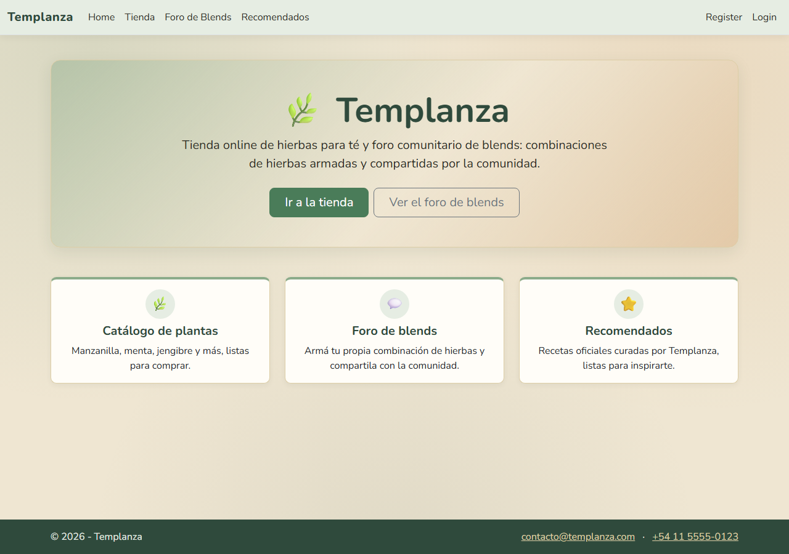 |
| **Catálogo** (filtro por categoría) | 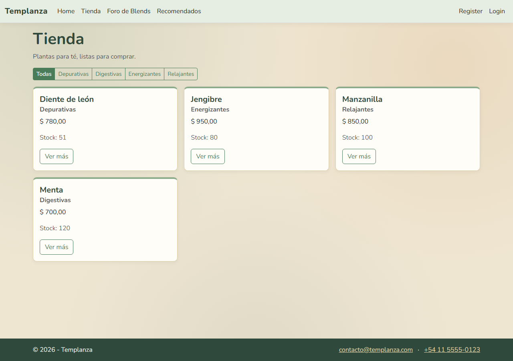 |
| **Detalle de planta** (agregar al carrito con stepper) | 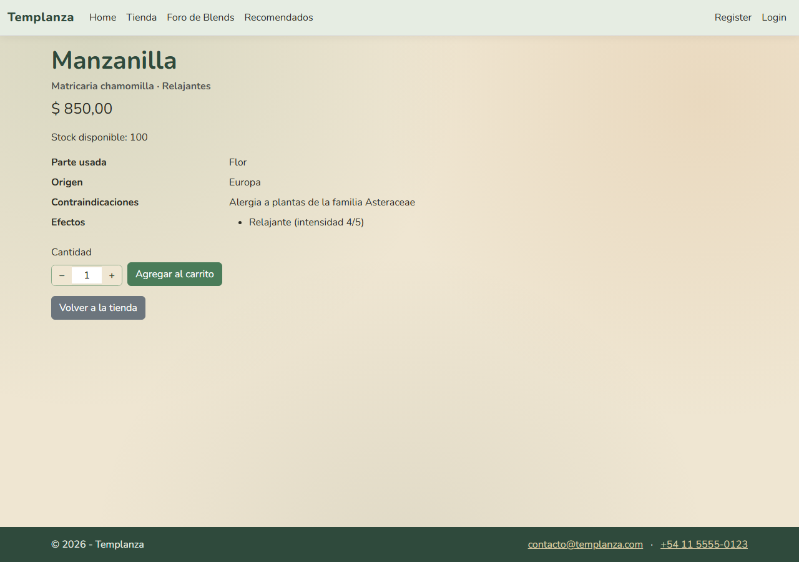 |

### Foro de blends

| | |
|---|---|
| **Foro comunitario** | 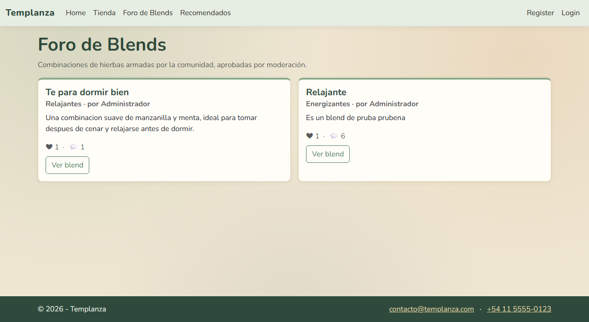 |
| **Detalle de blend** (comentarios y likes) | 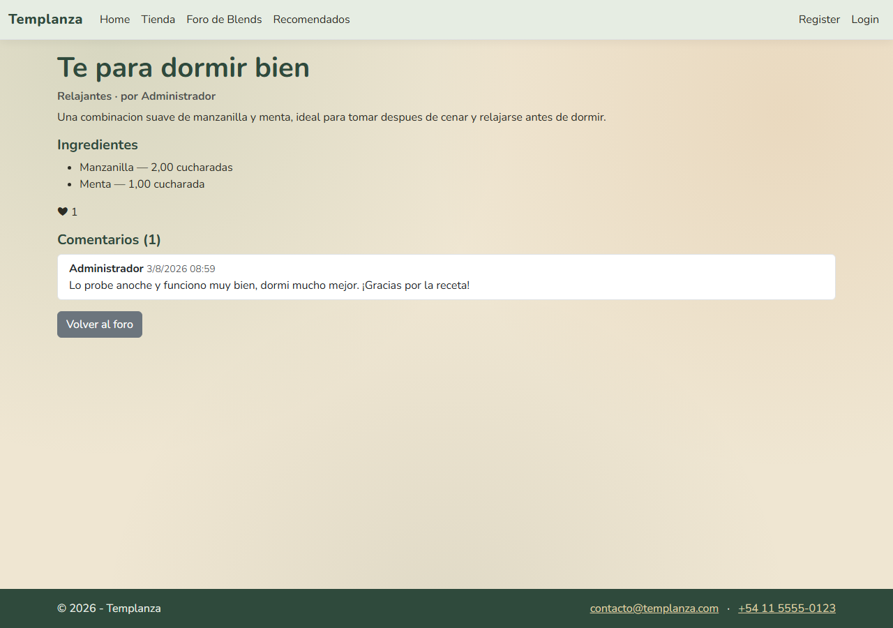 |
| **Blends recomendados** | 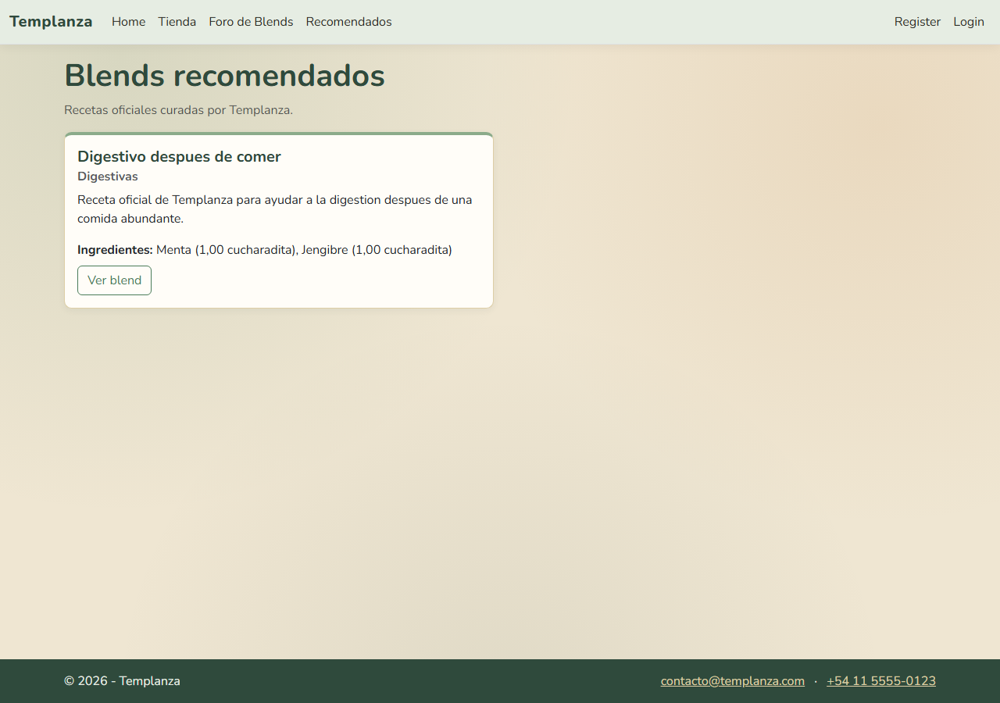 |

### Cuenta

| | |
|---|---|
| **Registro** | 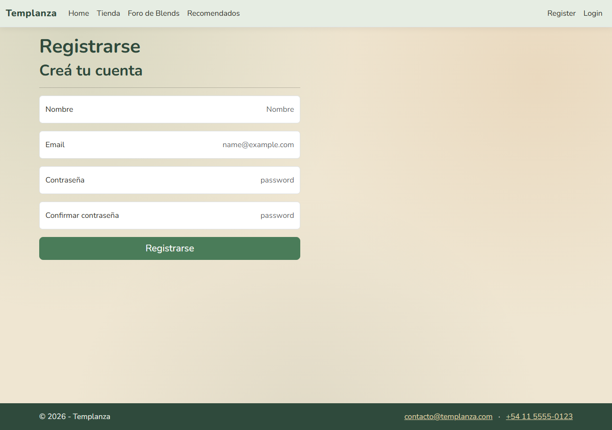 |
| **Login** | 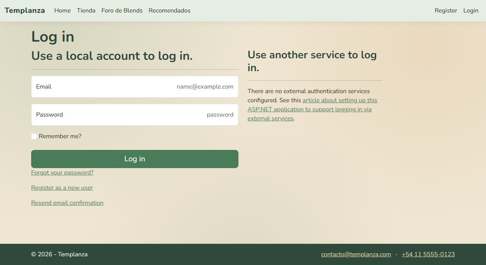 |

### Compra y pago

| | |
|---|---|
| **Orden pendiente con QR de Mercado Pago** (en mobile se muestra un botón de redirect en vez del QR) | 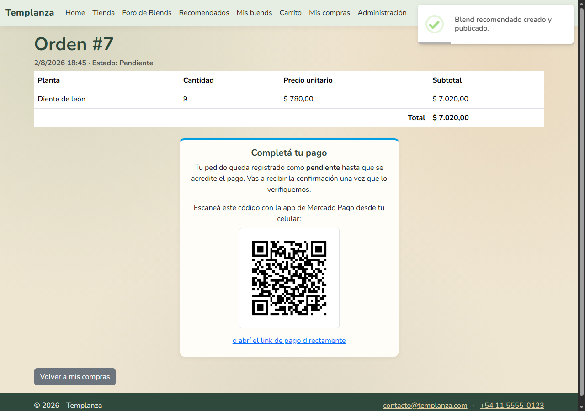 |

### Panel de administración (`/Admin`, roles Administrador/Operador)

| | |
|---|---|
| **Dashboard** | 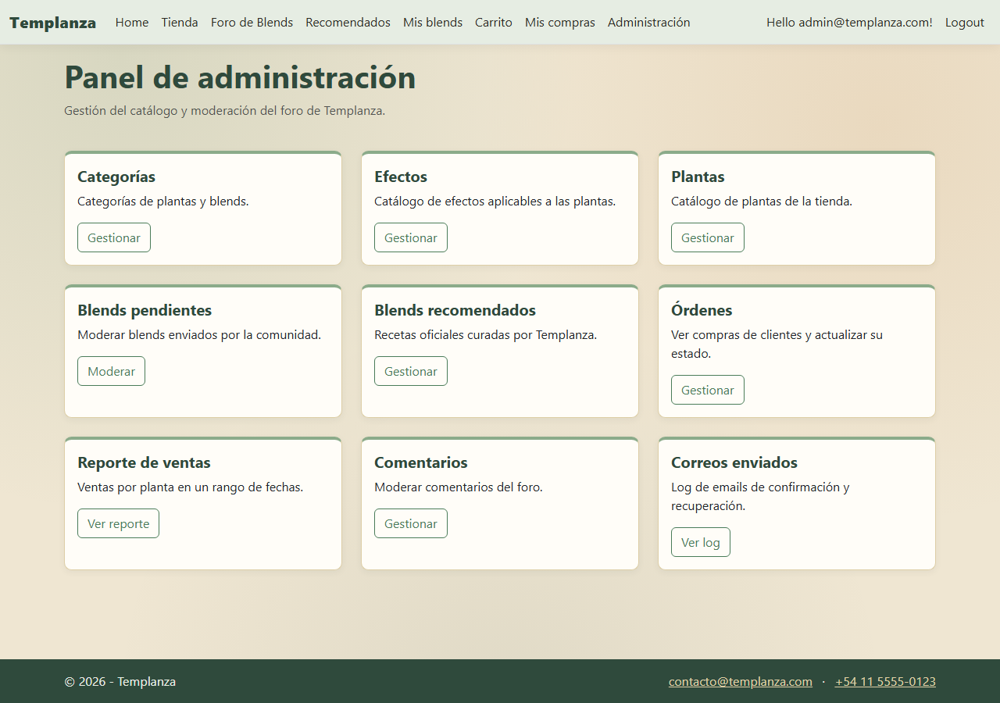 |
| **CRUD de Plantas** (búsqueda y paginación hechas a mano) | 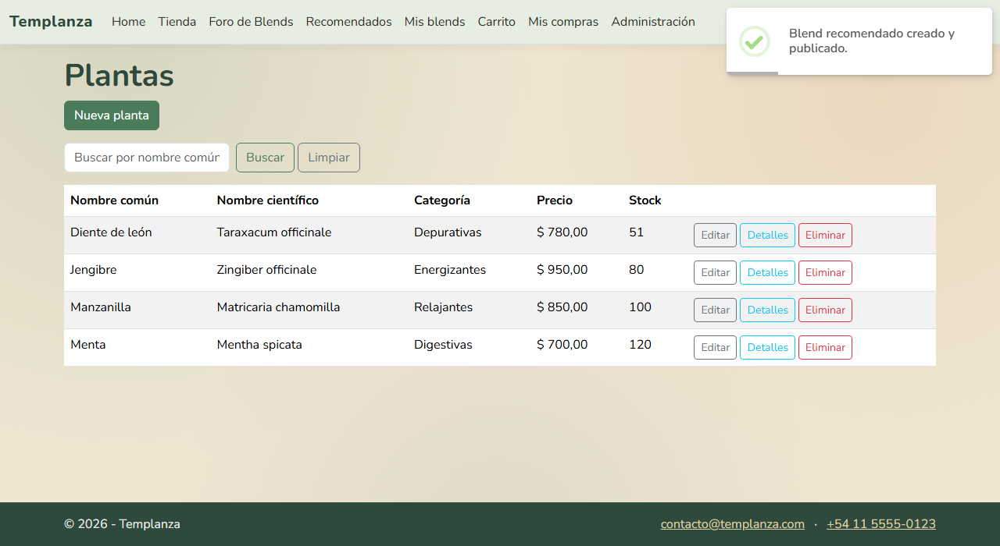 |
| **CRUD de Categorías** (con DataTable) | 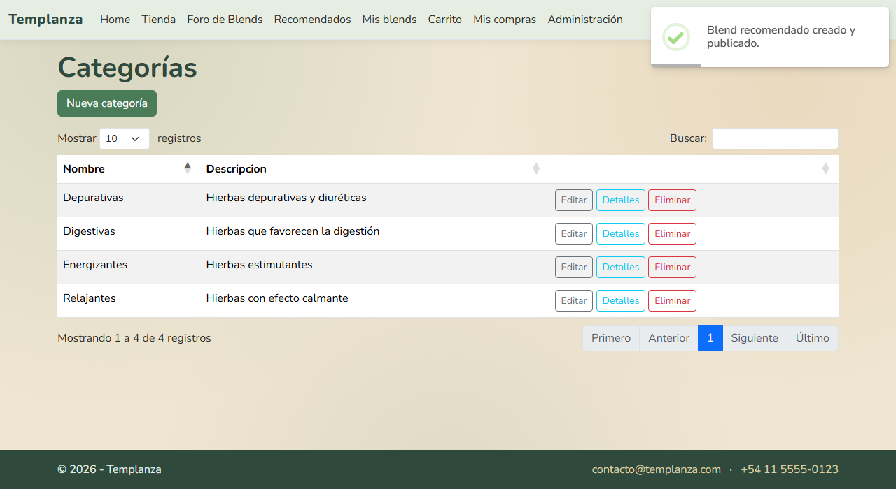 |
| **Moderación de blends pendientes** | 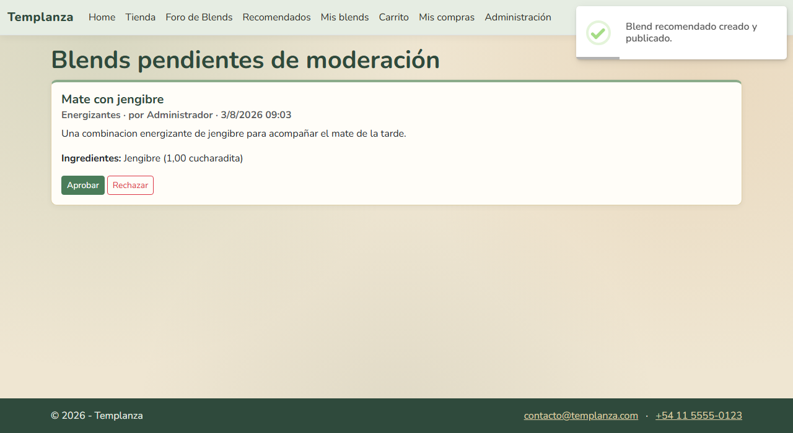 |
| **Órdenes** (ver compras y cambiar estado) | 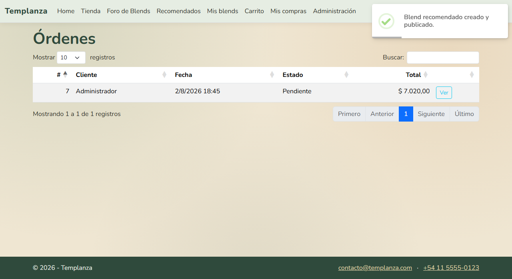 |
| **Reporte de ventas** (stored procedure, por rango de fechas) | 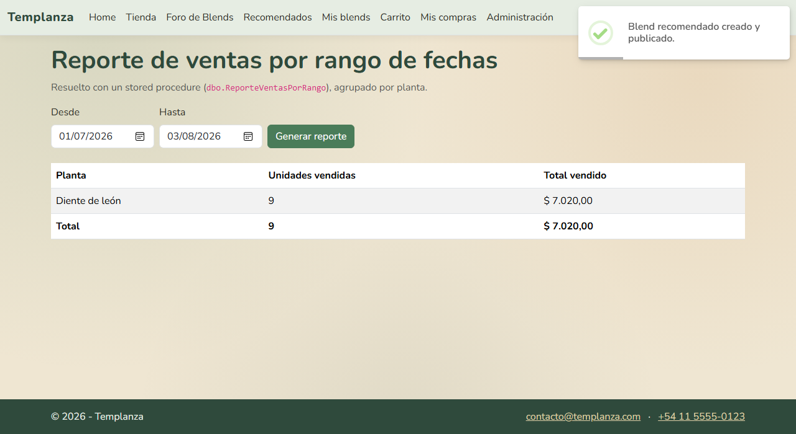 |

## Integrantes

Pedro Riestra
